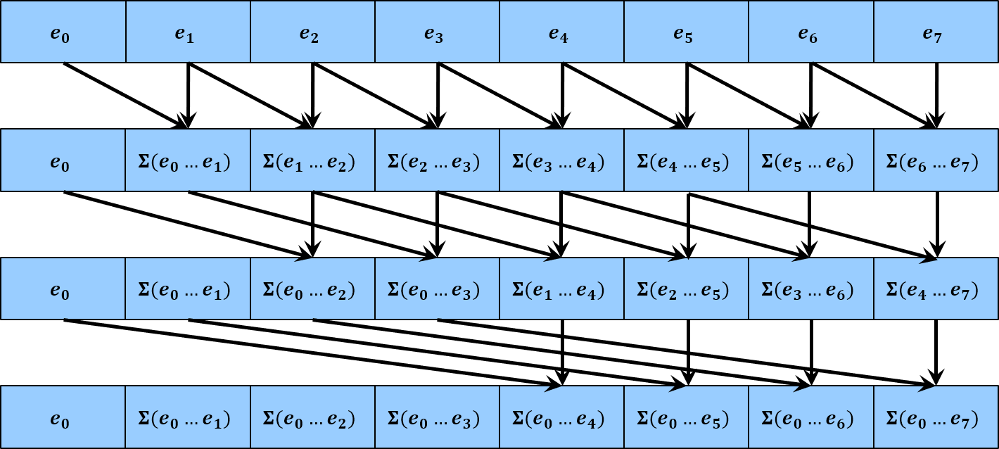

[中文版](README.md)

# Mamba CUDA Implementation Analysis

## State Space Model (SSM)

This article analyzes and derives the CUDA code for the Mamba model from the paper **"Mamba: Linear-time sequence modeling with selective state spaces"**[1],  attempting to explain why Mamba is computationally efficient. (**Although Mamba2 has been published at ICML and relies mainly on the Triton library for efficient implementations, avoiding CUDA optimization issues, the original Mamba still has significant reference value**).

Before delving into the code, you can refer to Su Jianlin's blog post ["Revisiting SSM (1): Linear Systems and HiPPO Matrices" (In Chinese)](https://spaces.ac.cn/archives/10114) for an introduction to the theory behind Mamba, ultimately leading to the following basic form of the State Space Model (SSM):

```math
\begin{equation}
\begin{aligned}
    x'(t) &= Ax(t) + Bu(t), \\
    y(t) &= Cx(t) + Du(t),
\end{aligned}
\tag{1}
\end{equation}
```

Intuitive explanation: $u(t) \in \mathbb{R}^{D}$ is a function used to record information over a period of time, where $t$ is a continuous time variable, i.e., at any moment $t=t_0$, $u(t_0)$ describes the signal at that moment. Based on this, the first line of differential equation (1) introduces the hidden state variable $x(t) \in \mathbb{R}^{N}$, and establishes the relationship between $x(t)$ and $u(t)$ through the predefined matrices $A \in \mathbb{R}^{N\times N}, B \in \mathbb{R}^{N \times D}$ and the equation $x'(t) = Ax(t) + Bu(t)$ (note that $x^\prime(t)$ is the derivative with respect to $t$). The second line of Equation (1) gives $y(t)$ after determining the values of $x(t)$ and $u(t)$, hence no further discussion is needed (**subsequent discussion will only focus on the first line**). In summary: Input $u(t)$, through the hidden variable $x(t)$, outputs $y(t)$.

## Discretization of SSM

The above form of SSM pertains to the continuous variable $t$, but it cannot be applied directly in practical computations, thus necessitating discretization. This section references ["SSM Discretization Derivation" (In Chinese)](https://zhuanlan.zhihu.com/p/680534665) to obtain the following computable iterative form:

```math
\begin{equation}
\begin{aligned}
    x_k &= \bar{A}x_{k-1} + \bar{B}u_k, \\
    y_k &= Cx_k + Du_k, \\
    \bar{A} &= e^{\Delta A}, \\
    \bar{B} &= A^{-1}(e^{\Delta A}-I)B, \\
\end{aligned}
\tag{2}
\end{equation}
```

Here, the time step $\Delta = t_k - t_{k - 1} \in \mathbb{R}^{1}$ is introduced, where $t_k, t_{k - 1}$ are the moments used for sampling during discretization, $A \in \mathbb{R}^{N\times N}, B \in \mathbb{R}^{N \times D}$ as above, and $I$ is the identity matrix.

Intuitive explanation: $u_k$ can correspond to a token in natural language, i.e., given a sequence of length $L$ with $D$ channels of tokens $u_1, u_2, \ldots, u_L \in \mathbb{R}^{D}$, SSM first maps this sequence through the iteration defined in Equation (2) to the hidden states corresponding to each token $x_k \in \mathbb{R}^{N}$, and then linearly maps to the output $y_k$. (**To simplify subsequent analysis, the part about $y_k$ is omitted here, as it is merely a simple linear combination of $x_k, u_k$**).

## Mamba SSM

Equation (2) describes a fixed-parameter SSM, but for Mamba, it uses parameters that depend on input variations, resulting in the following form:

```math
\begin{equation}
\begin{aligned}
	x_k &= \bar{A_k} x_{k-1} + \bar{B_k} u_k, \\
	\bar{A_k} &= e^{\Delta_k A}, \\
	\bar{B_k} &= A^{-1}(e^{\Delta_k A} - I)B_k, \\
\end{aligned}
\tag{3}
\end{equation}
```

Where $\Delta_k = \Delta_k(u_k) \in \mathbb{R}^{1}$, and $B_k = B_k(u_k) \in \mathbb{R}^{N\times D}$ are determined by the input $u_k$. For example, they can be generated by a simple linear mapping $\text{Linear}(u_k) $[1].

## Simplification of Mamba SSM

Mamba simplifies SSM on two levels in its implementation. First, for the multi-channel $u_k$, each channel is processed completely independently in actual computation, significantly reducing the computation load and facilitating GPU parallel processing. Therefore, $u_k^i \in \mathbb{R}^1$ denotes the $i$-th channel of $u_k$, and due to the independence of the channels, Equation (3) is transformed into independent computations for each channel. Also, considering that each parameter is trainable, the parameters $\bar{A_k}, \bar{B_k}$ do not need to be calculated entirely according to Equation (3) (which involves matrix inversion), thus they are also simplified, resulting in the following form:

```math
\begin{equation}
\begin{aligned}
	x_{k}^{i} &= \bar{A_k^i}x_{k-1}^{i} + \bar{B_k^i}u_{k}^{i} \in \mathbb{R}^N,
\end{aligned}
\tag{4}
\end{equation}
```

Where $\bar{A_k^i}, \bar{B_k^i}$ are defined as

```math
\begin{equation}
\begin{aligned}
	\bar{A_k^i} &= \text{diag}(e^{\Delta_k^i A}) \in \mathbb{R}^{N\times N}, \\
	\bar{B_k^i} &= \Delta_{k}^{i}\mu_{k}^{i}B_k \in \mathbb{R}^{N\times 1}, \\
\end{aligned}
\tag{5}
\end{equation}
```

Here, $\text{diag}(x)$ means to convert the vector $x$ into a corresponding diagonal matrix, placing $x$ on the diagonal, with all involved variables in the following format:

```math
\begin{equation}
\begin{aligned}
u_{k}^{i} \in \mathbb{R}^1, x_{k}^{i} \in \mathbb{R}^N, \Delta_{k}^{i} \in \mathbb{R}^1, \mu_{k}^{i} \in \mathbb{R}^1, A \in \mathbb{R}^N, B_k \in \mathbb{R}^{N\times 1}
\end{aligned}
\end{equation}
```

Where $\Delta_{k}^{i}, \mu_k^i, B_k$ are determined by the input $u_k$, with $A$ simplified from the original $N \times N$ matrix to an $N$-dimensional vector.

On the second level of simplification, since $\bar{A_k^i}$ forms a diagonal matrix, it allows for independent computation on each channel of $x_k^i$. Considering the $j$-th channel of $x_k^i \in \mathbb{R}^N$, define $v_k$ as the $j$-th element of $x_k^i$, define $a_k$ as the $j$-th element of $e^{\Delta_{k}^{i}A} \in \mathbb{R}^N$, and define $b_k$ as the $j$-th element of $\bar{B_k^i}$, namely:

```math
\begin{equation}
\begin{aligned}
v_k &= [x_k^i]_j, \\
a_k &= [e^{\Delta _{k}^{i}A}]_j, \\
b_k &= [\bar{B_k^i}]_j. \\
\end{aligned}
\tag{6}
\end{equation}
```

Therefore, the core iterative formula (per channel of $x_k^i$) is:

```math
v_k = a_k v_{k-1} + b_k u_{k}^{i} \in \mathbb{R}^1.
\tag{7}
```

The most direct way to compute all $v_0, v_1, \ldots, v_L$ and thus implement SSM is to start from the initial value $v_0$ and iteratively apply Equation (7) in a serial loop, but this method is not efficient, hence the following parallel computation process is introduced.

## Parallel Computation of Mamba SSM

Expanding Equation (7) yields the following form:

```math
\begin{aligned}
    v_k &= a_k v_{k-1} + b_k u_{k}^{i} \\
    &= a_k (a_{k-1} v_{k-2} + b_{k-1} u_{k-1}^{i}) + b_k u_{k}^{i} \\
    &= a_k a_{k-1} v_{k-2} + a_k b_{k-1} u_{k-1}^{i} + b_k u_{k}^{i} \\
    &\vdots \\
    &= a_k a_{k-1} \cdots a_1 v_0 + \sum_{j=1}^k {\left( \prod_{m=j+1}^k{a_m} \right)} b_j u_{j}^{i}. \\
\end{aligned}
\tag{8}
```

Although Equation (8) appears complex, it primarily involves three types of variables:

```math
\begin{aligned}
    &a_{m\ldots n} = a_m a_{m-1} \ldots a_n, \\
    &v_k, \\
    &c_j = b_j u_j^i. \\
\end{aligned}
```

Thus, Equation (8) simplifies to:

```math
v_k = a_{k\ldots 0} v_0 + \sum_{j=1}^k a_{k\ldots j+1} c_j.
\tag{9}
```

This leads to the construction of the following operator (**inferred from Mamba's CUDA code**):

```math
\begin{aligned}
    \left[ \begin{array}{c}
    a_{k-1} \\
    v_{k-1} \\
    \end{array} \right] 
    \oplus
    \left[ \begin{array}{c}
    a_k \\
    c_k \\
    \end{array} \right] &= \left[ \begin{array}{c}
    a_k a_{k-1} \\
    a_k v_{k-1} + c_k \\
    \end{array} \right] \\
\end{aligned}
\tag{10}
```

It is trivial to demonstrate that this operator $\oplus$ satisfies the associative law:

```math
\begin{aligned}
    & \left( \left[\begin{array}{c}
    a_{k-2} \\
    v_{k-2} \\
    \end{array} \right] \oplus
    \left[ \begin{array}{c}
    a_{k-1} \\
    c_{k-1} \\
    \end{array} \right] \right) \oplus \left[ \begin{array}{c}
    a_k \\
    c_k \\
    \end{array} \right] = \left[ \begin{array}{c}
    a_{k-1} a_{k-2} \\
    a_{k-1} v_{k-2} + c_{k-1} \\
    \end{array} \right] \oplus \left[ \begin{array}{c}
    a_k \\
    c_k \\
    \end{array} \right]
    = \left[ \begin{array}{c}
    a_k a_{k-1} a_{k-2} \\
    a_k (a_{k-1} v_{k-2} + c_{k-1}) + c_k \\
    \end{array} \right], \\
    & \left[ \begin{array}{c}
    a_{k-2} \\
    v_{k-2} \\
    \end{array} \right] \oplus \left( \left[ \begin{array}{c}
    a_{k-1} \\
    c_{k-1} \\
    \end{array} \right] \oplus \left[ \begin{array}{c}
    a_k \\
    c_k \\
    \end{array} \right] \right) =  \left[ \begin{array}{c}
    a_{k-2} \\
    v_{k-2} \\
    \end{array} \right] \oplus \left[ \begin{array}{c}
    a_k a_{k-1} \\
    a_k c_{k-1} + c_k \\
    \end{array} \right]
    = \left[ \begin{array}{c}
    a_k a_{k-1} a_{k-2} \\
    (a_k a_{k-1}) v_{k-2} + (a_k c_{k-1} + c_k) \\
    \end{array} \right], \\
    & \implies \left( \left[ \begin{array}{c}
    a_{k-2} \\
    v_{k-2} \\
    \end{array} \right] \oplus
    \left[ \begin{array}{c}
    a_{k-1} \\
    c_{k-1} \\
    \end{array} \right] \right) \oplus \left[ \begin{array}{c}
    a_k \\
    c_k \\
    \end{array} \right] = \left[ \begin{array}{c}
    a_{k-2} \\
    v_{k-2} \\
    \end{array} \right] \oplus \left( \left[ \begin{array}{c}
    a_{k-1} \\
    c_{k-1} \\
    \end{array} \right] \oplus \left[ \begin{array}{c}
    a_k \\
    c_k \\
    \end{array} \right] \right).
\end{aligned}
```

Further simplifying notation, define:

```math
\begin{aligned}
& s_k = \left[ \begin{array}{c}
    a_k \\
    v_k \\
    \end{array} \right],
& e_k = \left[ \begin{array}{c}
    a_k \\
    c_k \\
    \end{array} \right]
\end{aligned}
```

And according to Equation (7), the recursive process follows:

```math
\begin{aligned}
    &s_{k-1} \oplus e_k = \left[ \begin{array}{c}
    a_k a_{k-1} \\
    a_k v_{k-1} + c_k \\
    \end{array} \right] = \left[ \begin{array}{c}
    a_k a_{k-1} \\
    v_k \\
    \end{array} \right], \\
    &s_{k-2} \oplus e_{k-1} \oplus e_k = \left[ \begin{array}{c}
    a_{k-1} a_{k-2} \\
    v_{k-1} \\
    \end{array} \right] \oplus e_k = \left[ \begin{array}{c}
    a_k a_{k-1} a_{k-2} \\
    v_k \\
    \end{array} \right], \\
    &\vdots \\
    &s_0 \oplus e_1 \oplus \cdots \oplus e_k = \left[ \begin{array}{c}
    a_k a_{k-1}\cdots a_0 \\
    v_k \\
    \end{array} \right]. \\
\end{aligned}
```

By the associative property of the operator $\oplus$, it can be seen:

```math
\begin{aligned}
    \left[ \begin{array}{c}
    a_k a_{k-1}\cdots a_0 \\
    v_k \\
    \end{array} \right] &= \left( \cdots \left( \left( s_0 \oplus e_1 \right) \oplus e_2 \right) \cdots \oplus e_k \right) \\
    &= s_0 \oplus \left( e_1 \oplus \cdots \oplus e_k \right) \oplus \left( e_{n+1} \oplus \cdots \oplus e_k \right). \\
\end{aligned}
\tag{11}
```

This means that the originally serial computation of $v_k$ can be transformed into parallel computation, and this constitutes a Prefix Sum computation issue, that is, seeking (given the initial value $s_0$ and each $e_k$):

```math
\begin{aligned}
&v_1 = [s_0 \oplus e_1]_2, \\
&v_2 = [s_0 \oplus e_1 \oplus e_2]_2, \\
&\vdots \\
&v_k = [s_0 \oplus e_1 \oplus \cdots \oplus e_k]_2.
\end{aligned}
\tag{12}
```

Where $[x]_2$ denotes taking the second element of vector $x$. Moreover, CUDA already has efficient parallel prefix sum computation implementations like [BlockScan](https://nvidia.github.io/cccl/cub/api/classcub_1_1BlockScan.html#classcub_1_1blockscan), included in the [CUB](https://nvidia.github.io/cccl/cub/index.html) library.


## Parallel Computation of Prefix Sum

The parallel computation of prefix sums can fully utilize the associative property of generalized summation operators (i.e., the $\oplus$ operator mentioned above), changing the order of summation to achieve efficient parallel computation, as shown below:



Each row in the diagram represents one loop iteration. During the $i$-th iteration, the $j$-th CUDA thread retrieves the corresponding value from the address $j$ and adds it to the address $j + 2^{i-1}$. For a detailed discussion on prefix sums and an introduction to the prefix sum function of [BlockScan](https://nvidia.github.io/cccl/cub/api/classcub_1_1BlockScan.html#classcub_1_1blockscan), refer to Chapter 11 of "Programming Massively Parallel Processors: A Hands-on Approach".


## CUDA Code Analysis

Based on the theoretical derivation above, Mamba's CUDA implementation efficiently computes the SSM iteration process through parallel prefix sum algorithms. For specific implementation details, please refer to Mamba's official code repository.

## References

**[1] Gu, Albert, and Tri Dao. "Mamba: Linear-time sequence modeling with selective state spaces."**


