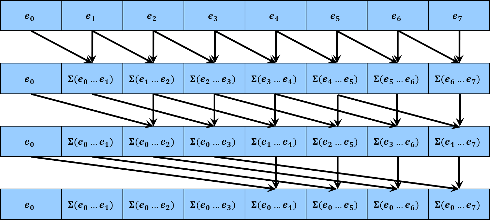

[English Version](README.en.md)

# Mamba CUDA 实现解析

## SSM基本形式

这篇文章将对《**Mamba: Linear-time sequence modeling with selective state spaces**》中Mamba模型[1]的CUDA代码进行分析和推导，尝试解释下Mamba为何计算高效。（ **虽然Mamba2已经中了ICML且通过高效的重构而让其实现主要依赖于Triton库（避免CUDA的优化问题），但最初的Mamba仍然具有很高的参考价值** ）

在了解代码之前，可以参考苏剑林博客[《重温SSM（一）：线性系统和HiPPO矩阵》](https://spaces.ac.cn/archives/10114)对Mamba理论的介绍，最终导出如下SSM（State Space Model）的基本形式：

$$
\begin{equation}
\begin{aligned}
	x'(t) &= Ax(t) + Bu(t) \\
	y(t) &= Cx(t) + Du(t)
\end{aligned}
\tag{1}
\end{equation}
$$

物理含义： $u(t) \in \mathbb{R}^{D}$ 是用于记录一个时间段内信息的函数， $t$ 为连续的时间变量，即在任意时刻 $t=t_0$ ， $u(t_0)$ 描述了该时刻的信号，基于此构建上述微分方程（1）的第一行：引入隐藏状态变量 $x(t) \in \mathbb{R}^{N}$ ，并通过预定义矩阵 $A \in \mathbb{R}^{N\times N},B \in \mathbb{R}^{N \times D}$ 以及方程 $x'(t) = Ax(t) + Bu(t)$ 来建立 $x(t), u(t)$ 函数的联系（注意 $x^\prime(t)$ 是对 $t$ 求导）。公式（1）的第二行在确定 $x(t), u(t)$ 数值后由基本的线性计算给出 $y(t)$ ，因此不需要进一步讨论（**下文也只讨论对第一行的处理**）。总结：输入 $u(t)$ ，经过隐藏变量 $x(t)$ ，输出 $y(t)$ 。

## SSM离散化

上述SSM形式针对的是连续变量 $t$ ，但无法应用于实际计算，因此需要离散化，这部分参考 [《SSM离散化推导》](https://zhuanlan.zhihu.com/p/680534665)，并最终获得以下可实际计算的迭代形式：

$$
\begin{equation}
\begin{aligned}
	x_k&=\bar{A}x_{k-1}+\bar{B}u_k\\
	y_k&=Cx_k + Du_k \\
	\bar{A}&=e^{\Delta A}\\
	\bar{B}&=A^{-1}(e^{\Delta A}-I)B\\
\end{aligned}
\tag{2}
\end{equation}
$$

这里引入了时间步长 $\Delta = t_k - t_{k - 1} \in \mathbb{R}^{1}$ ，其中 $t_k, t_{k - 1}$ 为离散化时用于采样的时刻， $A \in \mathbb{R}^{N\times N},B \in \mathbb{R}^{N \times D}$ 同上， $I$ 为单位矩阵。

直观理解： $u_k$ 可以对应于自然语言中的token，即给定一个长度为 $L$ 并具有 $D$ 个通道的token序列 $u_1, u_2, \ldots, u_L \in \mathbb{R}^{D}$ ，SSM先通过公式（2）的迭代形式将这个序列映射为对应每个token的隐藏状态 $x_k \in \mathbb{R}^{N}$ ，后再线性映射为输出 $y_k$ 。（ **为便于后续分析，下文忽略 $y_k$ 的部分，其只是 $x_k, u_k$ 的简单线性组合** ）。

## Mamba SSM形式

公式（2）为参数固定的SSM，但对于Mamba则采用依赖于输入变化的参数，即有以下形式：

$$
\begin{equation}
\begin{aligned}
	x_k&=\bar{A_k} x_{k-1}+\bar{B_k}u_k\\
	\bar{A_k}&=e^{\Delta_k A}\\
	\bar{B_k}&=A^{-1}(e^{\Delta_k A}-I)B_k\\
\end{aligned}
\tag{3}
\end{equation}
$$

其中 $\Delta_k = \Delta_k(u_k) \in \mathbb{R}^{1}, B_k = B_k(u_k) \in \mathbb{R}^{N\times D}$ 根据输入 $u_k$ 决定，例如可以由简单线性映射 $\text{Linear}(u_k)$ 生成[1]。

## Mamba SSM简化

Mamba在实现上对SSM进行两个层面的简化，首先对于多通道的 $u_k$ ，其每个通道在实际计算时完全独立处理，这样大幅度降低计算量的同时也便于GPU的并行计算。因此，以下用 $u_k^i \in \mathbb{R}^1$ 指代 $u_k$ 的第 $i$ 个通道，并且由于通道间的独立性，公式（3）转化为单通道的独立计算；同时考虑到每个参数都是可训练的，参数 $\bar{A_k}, \bar{B_k}$ 不需要完全按照公式（3）的计算方式（涉及矩阵求逆运算），因此也做了一些简化，最终构成以下形式：

$$
\begin{equation}
\begin{aligned}
	x_{k}^{i} &=\bar{A_k^i}x_{k-1}^{i}+\bar{B_k^i}u_{k}^{i} \in \mathbb{R}^N
\end{aligned}
\tag{4}
\end{equation}
$$

其中 $\bar{A_k^i}, \bar{B_k^i}$ 定义为

$$
\begin{equation}
\begin{aligned}
	\bar{A_k^i} &=\text{diag} ( e^{\Delta_k^i A} ) \in \mathbb{R} ^{N\times N} \\
	\bar{B_k^i} &=\Delta_{k}^{i}\mu _{k}^{i}B_k\in \mathbb{R} ^{N\times 1}\\
\end{aligned}
\tag{5}
\end{equation}
$$

这里 $\text{diag}(x)$ 表示将其中的向量 $x$ 转为相应的对角矩阵，并将 $x$ 放置在对角线上，涉及到的所有变量具有以下形式：

$$
\begin{equation}
\begin{aligned}
u_{k}^{i}\in \mathbb{R}^1, x_{k}^{i}\in \mathbb{R}^N,\Delta _{k}^{i}\in \mathbb{R}^1, \mu _{k}^{i}\in \mathbb{R}^1 ,A\in \mathbb{R} ^N,B_k\in \mathbb{R} ^{N\times 1}
\end{aligned}
\end{equation}
$$

其中 $\Delta_{k}^{i}, \mu_k^i, B_k$ 由输入 $u_k$ 决定，这里的 $A$ 由原本的 $N \times N$ 矩阵简化为 $N$ 维向量。

在第二层面的简化，因为公式（4）中的 $\bar{A_k^i}$ 为对角矩阵，所以其可以在 $x_k^i$ 的每个通道上进行独立计算。考虑 $x_k^i \in \mathbb{R}^N$ 的第 $j$ 个通道，定义 $v_k$ 为 $x_k^i$ 的第 $j$ 个元素，相应定义变量 $a_k$ 为 $e^{\Delta _{k}^{i}A} \in \mathbb{R}^N$ 的第 $j$ 个元素，定义 $b_k$ 为 $\bar{B_k^i}$ 的第 $j$ 个元素，即

$$
\begin{equation}
\begin{aligned}
v_k &= [x_k^i]_j \\
a_k &= [e^{\Delta _{k}^{i}A}]_j \\
b_k &= [\bar{B_k^i}]_j \\
\end{aligned}
\tag{6}
\end{equation}
$$

因此，最终的核心迭代公式为（对 $x_k^i$ 所有通道均成立）：

$$
v_k=a_kv_{k-1}+b_ku_{k}^{i} \in \mathbb{R}^1
\tag{7}
$$

为计算所有的 $v_0, v_1, \ldots, v_L$ 从而实现SSM，最直接的方式就是从初始值 $v_0$ 开始迭代，利用公式（7）串行循环计算，但这样计算效率不高，由此引出以下的并行计算过程。

## Mamba SSM并行计算

对公式（7）展开，则构成以下形式

$$
\begin{aligned}
	v_k&=a_kv_{k-1}+b_ku_{k}^{i}\\
	&=a_k(a_{k-1}v_{k-2}+b_{k-1}u_{k-1}^{i})+b_ku_{k}^{i}\\
	&=a_ka_{k-1}v_{k-2}+a_kb_{k-1}u_{k-1}^{i}+b_ku_{k}^{i}\\
	&\vdots\\
	&=a_ka_{k-1}\cdots a_1v_0+\sum_{j=1}^k{\left( \prod_{m=j+1}^k{a_m} \right)}b_ju_{j}^{i}\\
\end{aligned}
\tag{8}
$$

公式（8）虽然复杂，但实际上主要有三个类型的变量，包括 

$$
\begin{aligned}
&a_{m\ldots n} = a_m a_{m-1} \ldots a_n, \\
&v_k, \\
&c_j = b_ju_j^i \\
\end{aligned}
$$

因此，公式（8）简化为

$$
v_k = a_{k\ldots 0} + \sum_{j=1}^k a_{k\ldots j+1} c_j
\tag{9}
$$

由此启发构造以下算子（ **由Mamba的CUDA代码反推** ）：

$$
\begin{aligned}
	\left[ \begin{array}{c}
	a_{k-1}\\
	v_{k-1}\\
\end{array} \right] 
\oplus
\left[ \begin{array}{c}
	a_k\\
	c_k\\
\end{array} \right] &=\left[ \begin{array}{c}
	a_{k} a_{k-1}\\
	a_k v_{k-1}+ c_k\\
\end{array} \right]\\
\end{aligned}
\tag{10}
$$

不难证明这个算子 $\oplus $ 满足结合律：

$$
\begin{aligned}
	& \left( \left[\begin{array}{c}
	a_{k-2}\\
	v_{k-2}\\
\end{array} \right] \oplus
\left[ \begin{array}{c}
	a_{k-1}\\
	c_{k-1}\\
\end{array} \right] \right) \oplus \left[ \begin{array}{c}
	a_k\\
	c_k\\
\end{array} \right] = \left[ \begin{array}{c}
	a_{k-1} a_{k-2}\\
	a_{k-1} v_{k-2} + c_{k-1}\\
\end{array} \right] \oplus \left[ \begin{array}{c}
	a_k\\
	c_k\\
\end{array} \right] 
	=\left[ \begin{array}{c}
	a_{k} a_{k-1} a_{k-2}\\
	a_k (a_{k-1} v_{k-2}+c_{k-1})+c_k \\
\end{array} \right]\\
& \left[ \begin{array}{c}
	a_{k-2}\\
	v_{k-2}\\
\end{array} \right] \oplus \left( \left[ \begin{array}{c}
	a_{k-1}\\
	c_{k-1}\\
\end{array} \right] \oplus \left[ \begin{array}{c}
	a_k\\
	c_k\\
\end{array} \right] \right) =  \left[ \begin{array}{c}
	a_{k-2}\\
	v_{k-2}\\
\end{array} \right] \oplus \left[ \begin{array}{c}
	a_{k} a_{k-1}\\
	a_k c_{k-1} + c_k\\
\end{array} \right] 
	=\left[ \begin{array}{c}
	a_{k} a_{k-1} a_{k-2}\\
	(a_k a_{k-1}) v_{k-2}+(a_k c_{k-1} + c_k)\\
\end{array} \right]\\
& \implies \left( \left[ \begin{array}{c}
	a_{k-2}\\
	v_{k-2}\\
\end{array} \right] \oplus
\left[ \begin{array}{c}
	a_{k-1}\\
	c_{k-1}\\
\end{array} \right] \right) \oplus \left[ \begin{array}{c}
	a_k\\
	c_k\\
\end{array} \right] = \left[ \begin{array}{c}
	a_{k-2}\\
	v_{k-2}\\
\end{array} \right] \oplus \left( \left[ \begin{array}{c}
	a_{k-1}\\
	c_{k-1}\\
\end{array} \right] \oplus \left[ \begin{array}{c}
	a_k\\
	c_k\\
\end{array} \right] \right)
\end{aligned}
$$

进一步简化符号，定义

$$
\begin{aligned}
& s_k=\left[ \begin{array}{c}
	a_k\\
	v_k\\
\end{array} \right] 
, e_k=\left[ \begin{array}{c}
	a_k\\
	c_k\\
\end{array} \right] 
\end{aligned}
$$

并且根据公式（7），有如下递推过程：

$$
\begin{aligned}
	&s_{k-1}\oplus e_k=\left[ \begin{array}{c}
	a_ka_{k-1}\\
	a_kv_{k-1}+c_k\\
\end{array} \right] =\left[ \begin{array}{c}
	a_ka_{k-1}\\
	v_k\\
\end{array} \right]\\
	&s_{k-2}\oplus e_{k-1}\oplus e_k=\left[ \begin{array}{c}
	a_{k-1}a_{k-2}\\
	v_{k-1}\\
\end{array} \right] \oplus e_k=\left[ \begin{array}{c}
	a_ka_{k-1}a_{k-2}\\
	v_k\\
\end{array} \right]\\
	&\vdots\\
	&s_0\oplus e_1\oplus \cdots \oplus e_k=\left[ \begin{array}{c}
	a_ka_{k-1}\cdots a_0\\
	v_k\\
\end{array} \right]\\
\end{aligned}
$$

根据算子 $\oplus$ 的结合律，可得

$$
\begin{aligned}
	\left[ \begin{array}{c}
	a_ka_{k-1}\cdots a_0\\
	v_k\\
\end{array} \right] &=\left( \cdots \left( \left( s_0\oplus e_1 \right) \oplus e_2 \right) \cdots \oplus e_k \right)\\
	&=s_0\oplus \left( e_1\oplus \cdots \oplus e_n \right) \oplus \left( e_{n+1}\oplus \cdots \oplus e_k \right)\\
\end{aligned}
\tag{11}
$$

这意味着可以把原本 $v_k$ 串行的计算形式转为并行计算，并且这是一个前缀和（Prefix Sum）计算问题，即求（给定初值 $s_0$ 和 各个 $e_k$ ）

$$
\begin{aligned}
&v_1 = [s_0 \oplus e_1]_2 \\
&v_2 = [s_0 \oplus e_1 \oplus e_2]_2 \\
&\cdots \\
&v_k = [s_0 \oplus e_1 \oplus \cdots \oplus e_k]_2
\end{aligned}
\tag{12}
$$

其中 $[x]_2$ 为取向量 $x$ 的第2个元素。并且CUDA中已有高效的并行前缀和计算实现[BlockScan](https://nvidia.github.io/cccl/cub/api/classcub_1_1BlockScan.html#classcub_1_1blockscan)，包含在[CUB](https://nvidia.github.io/cccl/cub/index.html)库中。

## 并行前缀和计算过程

前缀和的并行计算可以充分利用广义求和算子（例如上述的 $\oplus$ 算子）结合律性质，改变求和顺序来高效并行计算，最终如下所示：

图中每一行为一次循环过程，对于第 $i$ 次循环，第 $j$ 个CUDA线程从第 $j + 2^i$ 个地址上取出对应的数值并加到其对应的第 $j$ 个地址上，具体参考高效并行编程《Programming Massively Parallel Processors: A Hands-on Approach》第十一章对前缀和的描述以及[BlockScan](https://nvidia.github.io/cccl/cub/api/classcub_1_1BlockScan.html#classcub_1_1blockscan)的前缀和函数介绍。

# CUDA代码分析

待续。。。

## 参考文献

**[1] Gu, Albert, and Tri Dao. Mamba: Linear-time sequence modeling with selective state spaces.**

